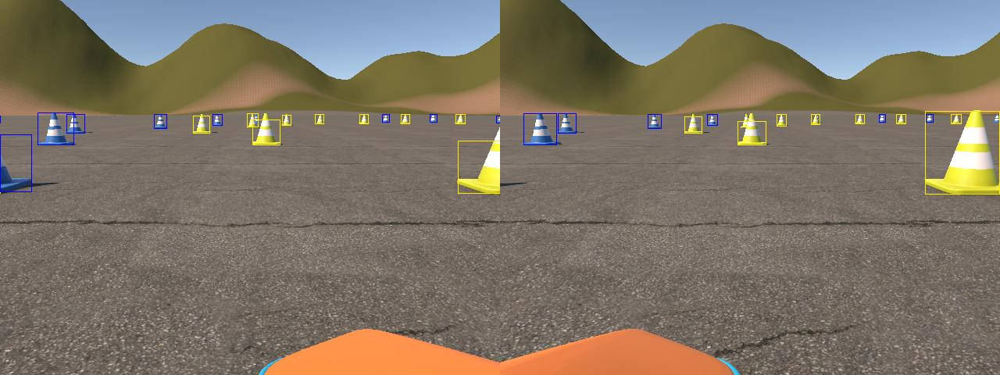
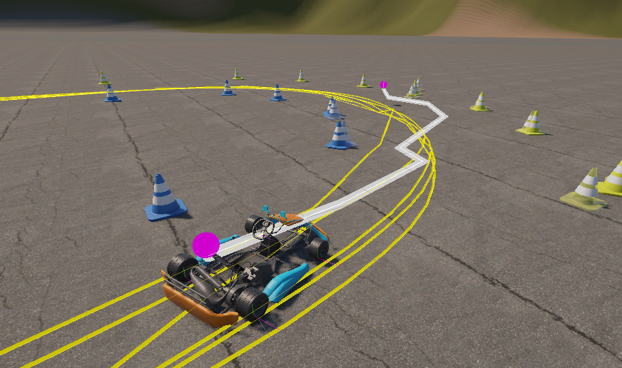
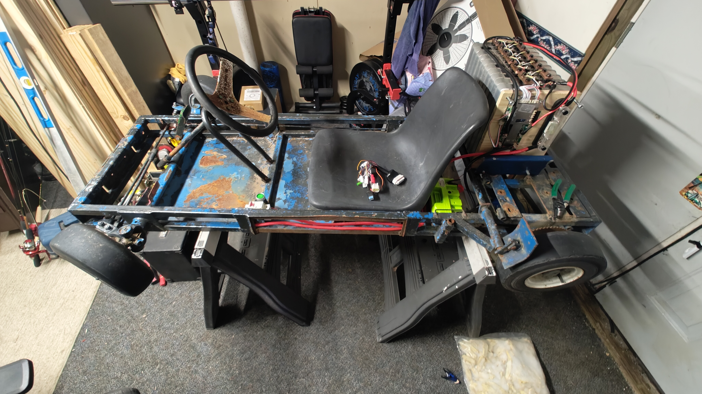
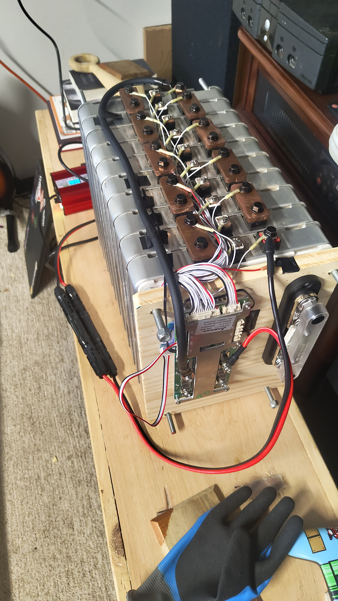

# AutoKart 🏎🤖

A simple self-driving go-kart project capable of navigating a cone track.  
A Unity-based simulator with a semi-custom physics engine and real-time pathfinding.  

 <!-- GIF placeholder -->

## Overview
AutoKart combines embedded hardware, computer vision, and custom simulation tools to create a simple yet functional self-driving go-kart.  
The go-kart is equipped with **3 core sensors**:
- Wheel speed sensor
- IMU (accelerometer + gyroscope)
- Stereo RPI cameras

---

## Simulation Backend
The `AutoKartSim` folder contains a Unity-based simulator:
- **Custom Physics Engine** — models motor forces, tire grip, and other dynamics.
- **Simulated Sensors** — mirrors real-world IMU, wheel speed, and stereo camera data.
- **Real-Time Visualization** — displays pathfinding in various scenarios.
- Originally written in C#, converted to Python for embedded hardware.

The first step of camera processing pipeline. The trained yoloV8n model detects 98% of cones within a resonable error margin. The bounding boxes from these 2 pictures are then combined to get the distance from stero calculations.

Here you can see the planned local path (white) which is derived in algorithm derived from here ([Path planning using Delaunay triangulation](https://blogs.mathworks.com/student-lounge/2022/10/03/path-planning-for-formula-student-driverless-cars-using-delaunay-triangulation/)) and also from the a few other factors including the previous paths (yellow). Also visable is the visulation of where the algorithm things the cones are.

---

## Self-Driving Pipeline

[IMU + Wheel Speed] ---v ---------------------v  
[Stereo Cameras] -> [Cone Tracker] -> [Path Planner] -> [Path Follower]

The IMU which esetialy gives sensed acceleration values which greatly assist in estimating the cars position. On its own this can do almost 70% of the kart position estimation. Because quite complex real world phisics exist though wheel speed and camera dead reckoning are used to assist in estimating the position of the car.  

Stero cameras allow the car to have depth perception at close distances tackling the noise of monocam distance calculation. The Yolo model trained on the FSOCO dataset can easily identify each of the cones in the picture and even there color.  

Cone tracking is estialy an algorithm to try to remove as much noise as possible from the car position and cone estimations.

The path planner takes into account the current know position of cones and the past paths its created to create set of points and eventualy a midpoint path through the cones.  

The Follower follows closly to the predicted path but with smoothing and deceson making such as stopping for unavoidable obstacles.

---

## Hardware Overview (Add Links here)
- Premade go-kart frame
- QS138 70H V3 motor
- FarDriver ND72300 Motor Controller
- 10x Nissan Leaf Gen 1 battery modules (76V nominal)
- JBD 20S 100A BMS
- NVIDIA Jetson Orin Nano
- 2x Raspberry Pi cameras
- IMU sensor
- Worm gear motor (for steering)

The kart created for this project. Battery and Motor are in the rear. Motorcontroller is to the right under the seat. The kill switch is to the left of steering wheel. Steering Support holds up driving motor and encoder, the jetson computer with cameras and all of the estimation electonics.  
[Place Holder Till Project is finished]

---

Media

    Demo Video <!-- placeholder -->

    Simulation Showcase <!-- placeholder -->
